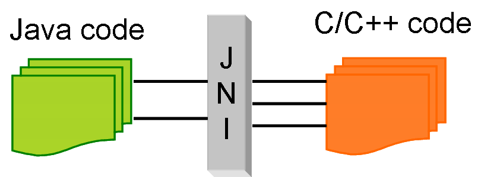

Android导入第三方静态库.a编译成动态库.so
<!--more-->


下面我以一个简单的实际例子来讲解如何在动态库中导入静态库。

静态库中的源代码有两个文件：static.h, static.c，有一个add方法 static.h
```
#include <stdio.h> 
int add(int x, int y);
static.c
#include "static.h" 
int add(int x, int y) 
{ 
    return x + y; 
}
```

将它编译成静态库，Android.mk如下：

```
LOCAL_PATH := $(call my-dir) 
include $(CLEAR_VARS) 
LOCAL_MODULE    := static_add 
LOCAL_SRC_FILES := static.c 
include $(BUILD_STATIC_LIBRARY)
```
注意编译静态库的时候，必须有一个Application.mk文件：
>APP_MODULES:=static_add

APP_MODULES的值应该和Android.mk中的LOCAL_MODULE的值保持一样。

然后调用ndk-build进行编译生成libstatic_add.a静态库

```
hejinlai_iMac:jni hejinlai$ ndk-build
Prebuilt : libstatic_add.a <= jni/ 生成静态库后，然后编写动态库中的源代码: share.h share.c share.h [cpp]#include 
int test_add(int x, int y);

share.c
1234567 #include “share.h”
#include “static.h”
int test_add(int x, int y)
{
// 调用static里面的方法
return add(x, y);
}
```

编写导入静态库的Android.mk：
```
LOCAL_PATH := $(call my-dir) 
include $(CLEAR_VARS) 
LOCAL_MODULE    := static_add 
LOCAL_SRC_FILES := libstatic_add.a 
include $(PREBUILT_STATIC_LIBRARY) 
include $(CLEAR_VARS) 
LOCAL_MODULE    := share_add 
LOCAL_STATIC_LIBRARIES := static_add 
LOCAL_SRC_FILES := share.c 
include $(BUILD_SHARED_LIBRARY)
```

注意上面生成的libstatic_add.a必须跟Android.mk放在同一目录下，否则需要填写相应的路径，然后进行编译：
```
hejinlai_iMac:jni hejinlai$ ndk-build
Compile thumb : share_add <= share.c Prebuilt : libstatic_add.a <= jni/ SharedLibrary : libshare_add.so Install : libshare_add.so => libs/armeabi/libshare_add.so
```

提示so编译成功。

需要注意的是我这边share.c和static.c放在同一目录下，如果放在不同的目录下，需要指定

LOCAL_C_INCLUDES链接到相应的路径。