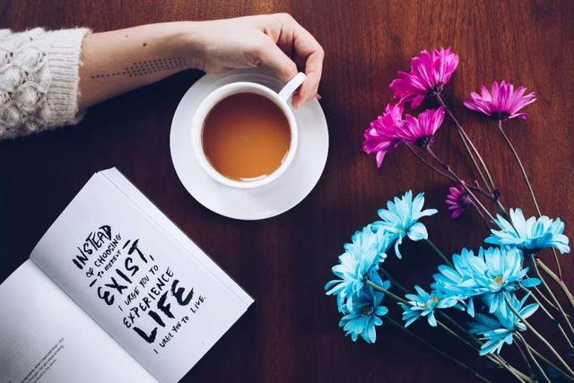
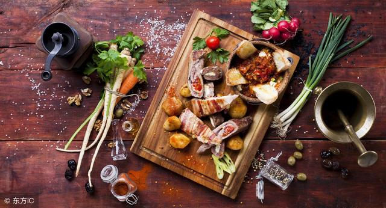

业余时间做什么，决定了你的生活品质
<!--more-->

# 摄影

看到朋友晓川发布的一条动态，配的图特别有意思，以为他去哪里旅行了。

一问才知道，他拍的地方其实只是这座城市一条不起眼的街道。

不由感叹，自己怎么就从来没有发现，这条街道还有这样美的一面。

这或许得益于晓川的摄影素养，他总能从日常生活中，发现不平凡的景致，捕捉稍纵即逝的瞬间。

晓川说，一次偶然，他在某摄影论坛看到了一位摄影师的作品，内心深受触动。

从那以后，从入手第一部相机，到埋头理论书籍，再到拍下自己的第一万零一张照片，他在摄影的道路上一去不复返。

他用镜头记录岁月的流逝，也用这种方式感受生活的诗意和从容。

看晓川相册里的光影世界，无论是花叶建筑，还是人间世故，都能感受到他内心的丰富和细腻。

对摄影爱好的坚持，也让他的生活变得充实丰盈起来。

其实，摄影也好，绘画也好，拥有一些爱好，可以体验不一样的生活方式，不断探索生命的广度和深度。

王小波说，**拥有自己的爱好，丰富的内心，再普通的日子也能过出妙趣横生，锦上添花般的诗意**。

一个人只注重眼前是不够的，他还应该在生活常态之外，追求更诗意有趣的世界。

而爱好就是你表达自我的最好途径。

# 美食

周末和几个朋友去赏桃花，时近正午，正有些饿了，小美拿出她亲手制作的提拉米苏蛋糕。

席地而坐后，小美还摘了一束粉紫色的野花，用养乐多瓶子插着，顿时感觉增色不少。

小美工作需要三班倒，平时非常忙。但无论如何，她都没有放弃对美食的追求。

休息时，她喜欢变着花样尝试制作不同的美食。

无论是精致的甜点，还是营养的羹汤，或者是可口的料理，她的手艺总能令人惊艳不已。

记得上次一个朋友过生日，小美为她制作了一个蛋糕，裱上了对方喜欢的花样。对方上传朋友圈后，获赞无数。

小美对美食的追求到了极致，有时为了买到最新鲜的食材，她会早起到市场采购。常常一顿饭菜下来，要花去不少时间精力。

但小美一点都没感觉到累，反而觉得这是一种调剂和享受。

当你专心去烹饪美食，并享受其中时，会感觉身边的一切都变得美好起来，仿佛世界都静止了。

**吃和思考，都是生命的必需品。**

作家朱利安·巴吉尼说，**好好吃，就是好好生活。**

如果人明白美食真正的价值和本质，就会关注美食带来的生活状态。

美食也有很好的治愈功能，一个人有吃的念头，就有活的欲望。

喜欢美食的人，也通常能把生活过得热气腾腾。

因为他内心怀着对生活的热爱，一餐一饭，都讲究精致。

他会明白，什么才是生活的真实。

# 运动

前段时间，表弟状态有些低迷，整日萎靡不振。

在别人的建议下，他开始跑步。

慢慢坚持下来后，他对待事物的态度开始变得积极，也喜欢上了这个运动。

表弟说，跑步时，我可以不受外界打扰，静下心来思考，反省自己。

有研究表明，人在快乐的时候，大脑会分泌一种叫做内啡肽的物质，而运动会加速这种物质的分泌。

一个坚持运动健身的人，往往也能做到自律、自爱，不会被欲望和情绪左右。

而以有益身心的运动消磨空闲时间的人，生活品质也不会太差。

周国平曾说，**排遣的方式，最能见出一个人的性情。**

有个朋友，闲暇时光喜欢尝试不同的东西：

比如背古诗文，觉得可以让自己内心沉静；

看各种纪录片，觉得这是了解世界最直观的方式；

还尝试学些入门的乐器，认为音乐给生活带来美好。

培养一些爱好，其实就是学会与自己相处，让一个人的生活变得有声有色。

或许有人认为，这些都是一些无用之事，谈不上兴趣爱好。

其实不然，**有味之事，往往无用**，并不是所有的爱好都要有用。

哪怕只是定期扔东西，整理房间，也是一种爱好。收拾房间能让心情变好，帮助你认识到什么才是想要的和值得追求的。

>**正如梁文道所说：读一些无用的书，做一些无用的事，花一些无用的时间，都是为了在一切已知之外，保留一个超越自己的机会，人生中一些很了不起的变化，就是来自这种时刻。**

**人生在世，总要找到一些专属于你的东西，才能让自己区别于其他人。**

如果没有兴趣爱好，就仅仅只是活着而已。

# 古人云

那些爱好广泛的人，其实是对这个世界保持好奇心。

精读君在终身成长词典《63：好奇》里提到：一个有好奇心的人，会思考云彩的形成与变换，会着迷于花蕾的初绽，觉察数学法则逻辑上的简洁性。

他会积极尝试不同事物，学习每一样新东西。

他会懂得欣赏一花一叶的美，也愿意尝试无用之事。

>古人云，不为无益之事，何以遣有涯之生？

你的爱好，就是你庸常生活的寄托，决定你的生活品质。
