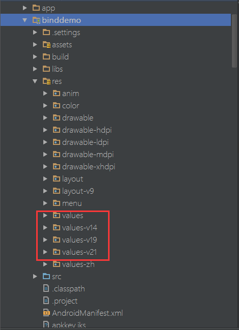
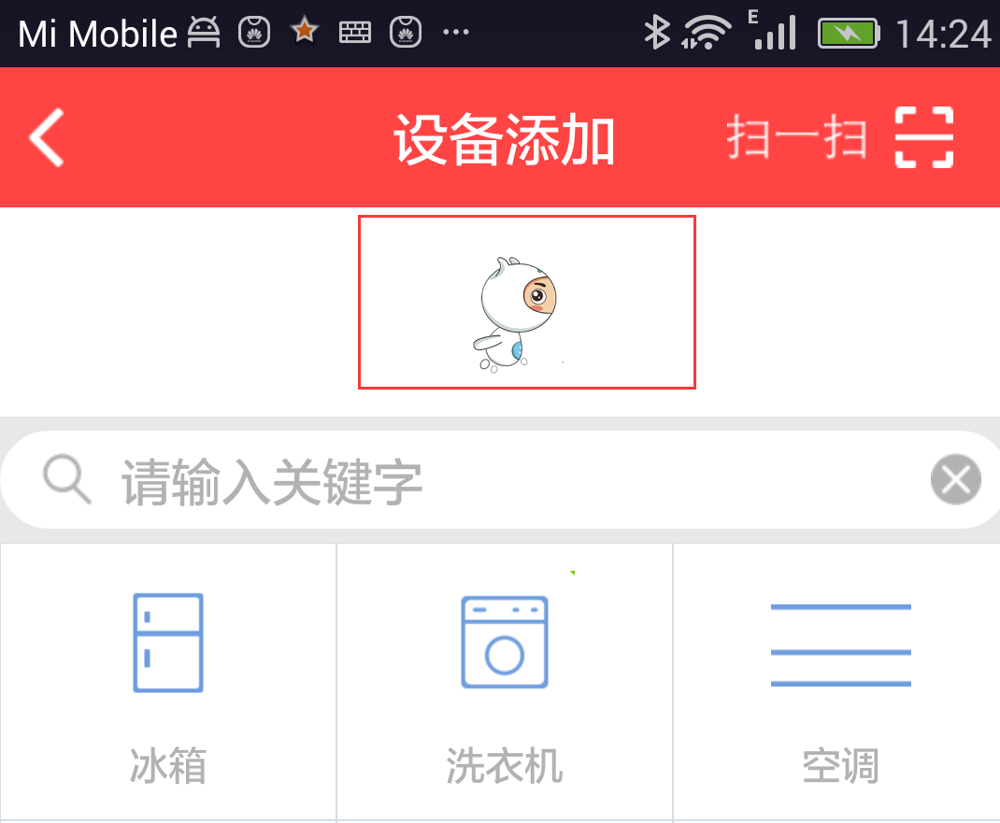

由于公共模块绑定满足不了TOB项目以及其他项目特殊需求，现对公共模块绑定界面的资源做成可配置，本文介绍一下哪些资源可配置以及如何配置。
<!--more-->
### 颜色配置
  颜色的配置需要在**res/values，res/values-v14，res/values-v19，res/values-v21**等目录下新建
  <font color=red face="黑体" size=4>color.xml</font>。
  color.xml内容如下：

```
<?xml version="1.0" encoding="utf-8"?>
<resources>
    <color name="title_bar_bg_color">#FFFF4444</color>
</resources>
```

  
  
  目录结构如图1所示


**图1**

**1.标题颜**
```
<?xml version="1.0" encoding="utf-8"?>
<resources>
    <color name="title_bar_bg_color">填入需要配置的颜色值（#FFFF0000）</color>
</resources>
```

**2.子分类列表背景色**
```
<?xml version="1.0" encoding="utf-8"?>
<resources>
    <color name="color_app_themes">填入需要配置的颜色值（#FFFF0000）</color>
</resources>
```

### 绑定动画配置
>在主工程**res/drawable**下分别新建**bind_scanning_anim.xml、bind_bouding_anim.xml、bind_failed_anim.xml、bind_sucess_anim.xml**资源文件；


1.**“扫描中“动画**（bind_scanning_anim.xml），代码如下：

```
<?xml version="1.0" encoding="utf-8"?>
<!--
    根标签为animation-list，其中oneshot代表着是否只展示一遍，设置为false会不停的循环播放动画
    根标签下，通过item标签对动画中的每一个图片进行声明
    android:duration 表示展示所用的该图片的时间长度
    
 -->
<animation-list xmlns:android="http://schemas.android.com/apk/res/android"
    android:oneshot="false">
    <item
        android:drawable="@drawable/scan1"
        android:duration="150"></item>
    <item
        android:drawable="@drawable/scan2"
        android:duration="150"></item>
</animation-list>

```
* 扫描中 使用帧动画，默认配置中两帧，即：scan1.png和scan2.png
* 图片分辨率:201x307

2.**绑定中 动画**（bind_bouding_anim.xml），代码如下:

```
<?xml version="1.0" encoding="utf-8"?>
<!--
    根标签为animation-list，其中oneshot代表着是否只展示一遍，设置为false会不停的循环播放动画
    根标签下，通过item标签对动画中的每一个图片进行声明
    android:duration 表示展示所用的该图片的时间长度
 -->
<animation-list xmlns:android="http://schemas.android.com/apk/res/android"
    android:oneshot="false">
    <item
        android:drawable="@drawable/bouding1"
        android:duration="150"></item>
    <item
        android:drawable="@drawable/bouding2"
        android:duration="150"></item>
    <item
        android:drawable="@drawable/bouding3"
        android:duration="150"></item>
    <item
        android:drawable="@drawable/bouding4"
        android:duration="150"></item>
    <item
        android:drawable="@drawable/bouding5"
        android:duration="150"></item>
</animation-list>
```
* 绑定中 使用帧动画，默认配置使用5帧，即：bouding1.png、bouding2.png、bouding3.png、bouding4.png、bouding5.png
* 图片分辨率：392x276

3.**失败 动画**（bind_failed_anim.xml），代码如下：

```
<?xml version="1.0" encoding="utf-8"?>
<!--
    根标签为animation-list，其中oneshot代表着是否只展示一遍，设置为false会不停的循环播放动画
    根标签下，通过item标签对动画中的每一个图片进行声明
    android:duration 表示展示所用的该图片的时间长度
 -->
<animation-list xmlns:android="http://schemas.android.com/apk/res/android"
    android:oneshot="false">
    <item
        android:drawable="@drawable/failed1"
        android:duration="150"></item>
    <item
        android:drawable="@drawable/failed2"
        android:duration="150"></item>
</animation-list>
```
* 扫描中 使用帧动画，默认配置使用2帧，即：failed1.png和failed2.png
* 图片分辨率:203x306


4.**成功 动画**（bind_sucess_anim.xml），代码如下：

```
<?xml version="1.0" encoding="utf-8"?>
<!--
    根标签为animation-list，其中oneshot代表着是否只展示一遍，设置为false会不停的循环播放动画
    根标签下，通过item标签对动画中的每一个图片进行声明
    android:duration 表示展示所用的该图片的时间长度
 -->
<animation-list xmlns:android="http://schemas.android.com/apk/res/android"
    android:oneshot="false">
    <item
        android:drawable="@drawable/sucess1"
        android:duration="150"></item>
    <item
        android:drawable="@drawable/sucess2"
        android:duration="150"></item>
</animation-list>

```
* 扫描中 使用帧动画，默认配置使用2帧，即：sucess1.png和sucess2.png
* 图片分辨率:203x306

### 网络请求loadding图标配置
在主工程**res/drawable**下分别新建**bind_network_waiting.xml**资源文件。
代码如下：

```
<?xml version="1.0" encoding="utf-8"?>
<animation-list xmlns:android="http://schemas.android.com/apk/res/android"
    android:oneshot="false">

    <item
        android:drawable="@drawable/load1"
        android:duration="200" />
    <item
        android:drawable="@drawable/load2"
        android:duration="200" />

</animation-list>
```
* 网络请求loadding 使用帧动画，默认配置使用2帧，即：load1.png和load2.png
* 图片分辨率:126x126

缺省配置如图2：


**图2**


### 下拉列表Header动画配置
在主工程**res/drawable**下分别新建**bind_droplistview_anim.xml**资源文件。
代码如下：
```
<?xml version="1.0" encoding="utf-8"?>
<!--
    根标签为animation-list，其中oneshot代表着是否只展示一遍，设置为false会不停的循环播放动画
    根标签下，通过item标签对动画中的每一个图片进行声明
    android:duration 表示展示所用的该图片的时间长度
 -->
<animation-list xmlns:android="http://schemas.android.com/apk/res/android"
    android:oneshot="false">
    <item
        android:drawable="@drawable/list1"
        android:duration="150"></item>
    <item
        android:drawable="@drawable/list2"
        android:duration="150"></item>
    <item
        android:drawable="@drawable/list3"
        android:duration="150"></item>
    <item
        android:drawable="@drawable/list4"
        android:duration="150"></item>
    <item
        android:drawable="@drawable/list5"
        android:duration="150"></item>
</animation-list>

```
* 下拉列表Header动画 使用帧动画，默认配置使用5帧，即：list1.png、list2.png、list3.png、list4.png、list5.png
* 图片分辨率:72x72

缺省配置如图3：



**图3**


